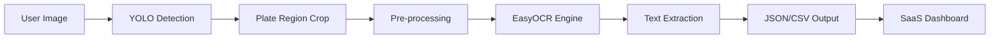

# 🛡️ AutoPlate AI — Smart ANPR Dashboard

[](https://opensource.org/licenses/MIT)
[](https://www.python.org/downloads/)
[](https://tailwindcss.com/)

**AutoPlate AI** is a high-performance, SaaS-style Automatic Number Plate Recognition (ANPR) platform. It provides a robust, end-to-end solution for detecting and reading license plates from images using state-of-the-art computer vision models.

Designed with a focus on both accuracy and developer experience, AutoPlate AI serves as a powerful foundation for building parking management systems, automated toll collection, or law enforcement tools.

---

## 🛠️ Technical Deep Dive

AutoPlate AI employs a sophisticated multi-stage pipeline to transform raw pixels into structured data:

1.  **Object Detection (YOLO)**: The system first identifies the exact region of the license plate within the input image. Our custom-tuned YOLO (You Only Look Once) architecture ensures high-speed detection even in complex backgrounds.
2.  **Image Pre-processing**: Once the plate region is cropped, it undergoes a series of enhancements:
    *   **Grayscale Conversion**: To reduce noise.
    *   **Bilateral Filtering**: To sharpen edges while preserving details.
    *   **Otsu's Thresholding**: To create a high-contrast binary image, ideal for OCR.
3.  **Optical Character Recognition (EasyOCR)**: The processed crop is passed to EasyOCR, which uses deep learning (ResNet + LSTM) to interpret the alphanumeric characters on the plate.
4.  **Data Serialization**: Results are structured into JSON/CSV format, providing confidence scores and detection coordinates for downstream integration.

---

## 💡 Real-World Use Cases

- 🅿️ **Smart Parking Management**: Automate entry and exit logging without manual ticket handling.
- 🛣️ **Electronic Toll Collection**: Detect and charge vehicles on highways in real-time.
- 🏢 **Security & Access Control**: Grant access to gated communities or office buildings based on registered plate numbers.
- 🚔 **Law Enforcement**: Identify vehicles of interest or track stolen vehicles through city-wide camera networks.

---

## 🏗️ System Architecture



---

## ✨ Key Features

- 🔍 **Real-time Detection**: Leverages YOLO for precise license plate bounding box detection.
- 📝 **Advanced OCR**: Pre-processes plate images for high-accuracy text extraction via EasyOCR.
- 🎨 **SaaS-Style Dashboard**: A futuristic, dark-mode-ready UI built with Tailwind CSS.
- 📥 **Bulk Processing**: Upload multiple images and process them in a single click.
- 📊 **Confidence Metrics**: Get granular accuracy percentages for every detection.
- 📂 **Export Capability**: Download results as CSV for further data analysis.

---

## 🚀 Tech Stack

- **Backend**: Python, Flask
- **AI/ML**: Ultralytics YOLO, EasyOCR, OpenCV
- **Frontend**: HTML5, JavaScript (ES6+), Tailwind CSS
- **Deployment**: Gunicorn, Procfile-ready

---

## 🛠️ Local Installation

1. **Clone the Repository**
   ```bash
   git clone https://github.com/yourusername/autoplate-ai.git
   cd autoplate-ai
   ```

2. **Set Up Environment**
   ```bash
   python -m venv venv
   source venv/bin/activate  # On Windows: venv\Scripts\activate
   pip install -r requirements.txt
   ```

3. **Configure Environment Variables**
   Create a `.env` file in the root directory:
   ```env
   ULTRALYTICS_API_KEY=your_api_key_here
   ```

4. **Run the Application**
   ```bash
   python app.py
   ```
   Access the dashboard at `http://localhost:5000`.

---

## 🏗️ Project Structure

```text
├── app.py                # Flask Web Server
├── platform-anpr.py      # AI Inference Logic
├── templates/            # UI Layouts
├── static/               # CSS, JS, and Assets
├── images/               # Input Image Storage
├── runs/                 # Processed Output & Results
└── requirements.txt      # Project Dependencies
```

---

## 🔮 Roadmap

- [ ] Multi-language plate support
- [ ] Real-time video stream integration
- [ ] User authentication & cloud storage
- [ ] Webhook notifications for detected plates

---

## ⚖️ License

Distributed under the **MIT License**. See `LICENSE` for more information.

---

<p align="center">
  Built with ❤️ by <b>Migo LABS</b>
</p>
