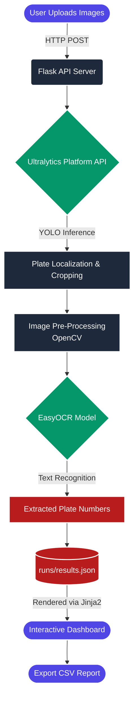

<div align="center">
  

  <h1>🛡️ AutoPlate AI</h1>
  <p><strong>Smart Automatic Number Plate Recognition (ANPR) Dashboard</strong></p>

  <p>
    <a href="https://opensource.org/licenses/MIT"></a>
    <a href="https://www.python.org/downloads/"></a>
    <a href="https://tailwindcss.com/"></a>
    <a href="https://huggingface.co/spaces/migolabs/AutoPlate-Ai"></a>
  </p>

  <h3>
    <a href="#-key-features">Features</a>
    <span> | </span>
    <a href="#-architecture--workflow">Architecture</a>
    <span> | </span>
    <a href="#️-installation">Installation</a>
    <span> | </span>
    <a href="https://huggingface.co/spaces/migolabs/AutoPlate-Ai">Live Demo</a>
  </h3>
</div>

---

## 📖 Overview

**AutoPlate AI** is a high-performance, SaaS-style Automatic Number Plate Recognition (ANPR) platform. Designed for modern research, parking management, and experimentation, it combines the power of **Ultralytics YOLO object detection** with **EasyOCR** text extraction to provide instant, accurate vehicle identification.

It features a sleek, dark-mode-ready UI built with Tailwind CSS, served locally via a robust Flask backend.

---

## 📸 Platform Gallery

<div align="center">
  <figure>
    
    <br>
    <figcaption><b>Figure 1:</b> Main Dashboard Interface</figcaption>
  </figure>
  <br><br>
  <figure>
    
    <br>
    <figcaption><b>Figure 2:</b> High-Accuracy Plate Detection & OCR Extraction</figcaption>
  </figure>
</div>

---

## ✨ Key Features

- 🌐 **Live Demo Available**: Instantly test the platform hosted on [Hugging Face Spaces](https://huggingface.co/spaces/migolabs/AutoPlate-Ai).
- 🔍 **Real-Time YOLO Detection**: Leverages the Ultralytics Platform API for highly accurate plate bounding box localization.
- 📝 **Advanced OCR Processing**: Incorporates bilateral filtering and OpenCV thresholding for optimal text extraction via EasyOCR.
- 🎨 **Futuristic SaaS Dashboard**: A responsive, dark-mode integrated interface built with Tailwind CSS.
- 📥 **Bulk Batch Processing**: Upload multiple vehicle images and process them synchronously with a single click.
- 📊 **Granular Confidence Metrics**: Get exact accuracy percentages for both bounding box localization and text extraction.
- 📂 **One-Click Export**: Download all session results directly as a `.csv` file for external data analytics.

---

## 🧠 Architecture & Workflow

AutoPlate AI is built on a modular pipeline ensuring fast inferences and highly accurate reads.



### Flow Breakdown:
1. **Ingestion:** Images are securely uploaded via the Flask REST API into the local `images/` directory.
2. **Localization:** A request containing the image payload is sent to the Ultralytics API. YOLO returns tight bounding boxes around detected license plates.
3. **Enhancement:** The backend crops the plate region, applies grayscale conversion, resizes (x2 interpolation), and uses a bilateral filter + OTSU thresholding to maximize text clarity.
4. **Extraction:** EasyOCR scans the processed crop and extracts the alphanumeric text alongside a confidence score.
5. **Delivery:** The bounding boxes and text are drawn onto the original image, saved to `runs/`, and served back to the Tailwind UI.

---

## 🚀 Tech Stack

| Layer | Technologies Used |
|-------|------------------|
| **Backend** | Python 3.8+, Flask, Gunicorn |
| **AI / Inference** | Ultralytics Platform API (YOLO), EasyOCR |
| **Computer Vision** | OpenCV (cv2) |
| **Frontend** | HTML5, JavaScript (ES6+), Tailwind CSS |
| **Deployment** | Hugging Face Spaces |

---

## 🛠️ Installation

Follow these steps to run AutoPlate AI locally on your machine.

### 1. Clone the Repository
```bash
git clone https://github.com/hasithaInduwaraUdagangoda/AutoPlate-AI.git
cd AutoPlate-AI
```

### 2. Set Up a Virtual Environment
It is highly recommended to use a virtual environment to manage dependencies.
```bash
python -m venv venv
# On Linux/MacOS
source venv/bin/activate
# On Windows
venv\Scripts\activate
```

### 3. Install Dependencies
```bash
pip install -r requirements.txt
```

### 4. Environment Variables
Create a `.env` file in the project root and add your Ultralytics Platform API key:
```env
ULTRALYTICS_API_KEY=your_ultralytics_api_key_here
```

### 5. Launch the Server
```bash
python app.py
```
> **Note:** The application will start on `http://localhost:5000`. Open this URL in your browser to access the dashboard.

---

## 🏗️ Repository Structure

```text
📦 autoplate-ai
 ┣ 📂 docs/               # Documentation assets and screenshots
 ┣ 📂 images/             # Temporary storage for user uploads
 ┣ 📂 runs/               # Output directory for processed images & JSON
 ┣ 📂 static/             # Static web assets (Tailwind CSS, JS)
 ┣ 📂 templates/          # Flask HTML (Jinja2) templates
 ┣ 📜 .env.example        # Template for environment variables
 ┣ 📜 app.py              # Main Flask web application
 ┣ 📜 platform-anpr.py    # Core AI inference & OpenCV pipeline
 ┣ 📜 requirements.txt    # Python dependencies
 ┗ 📜 README.md           # Project documentation
```

---

## 🔮 Roadmap

- [ ] **Multi-language plate support:** Expand EasyOCR configurations for global compatibility.
- [ ] **Real-time RTSP video streams:** Process live CCTV feeds natively in the browser.
- [ ] **Cloud Storage Integration:** Hook into AWS S3 / Supabase for persistent image storage.
- [ ] **Webhook Notifications:** Fire alerts to Slack/Discord when specific target plates are detected.

---

## 🤝 Contributing

Contributions make the open-source community such an amazing place to learn, inspire, and create. Any contributions you make are **greatly appreciated**. Please check the `CONTRIBUTING.md` file for guidelines.

---

## ⚖️ License

Distributed under the **MIT License**. See `LICENSE` for more information.

---

## 🌐 Connect with Us

Stay updated with our latest AI experiments and tools:

- 🔵 **Facebook:** [Migo LABS Official](https://web.facebook.com/migolabsofficial/)
- 💼 **LinkedIn:** [Migo LABS](https://linkedin.com/company/migolabs)
- 🎥 **YouTube:** [Migo LABS](https://www.youtube.com/@MigoLABS)

---

<p align="center">
  Built with ❤️ by <b><a href="https://huggingface.co/migolabs">Migo LABS</a></b>
</p>
